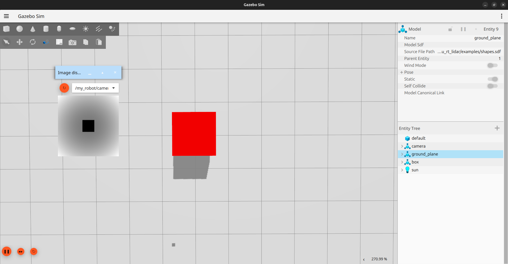
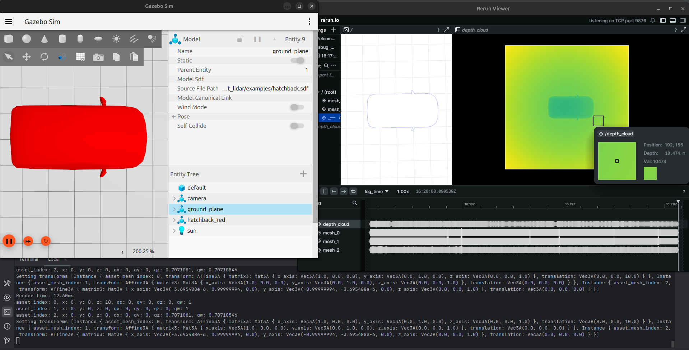

# WGPU based Raytracing Sensors for Gazebo

This project builds on the Raytracing sensors provided by the WGPU sensors library. Currently, this is a proof-of-concept stage and can render boxes, planes, and meshes, with ongoing efforts to expand its capabilities.

## Current Status
This project is currently in active development. While it can accurately render basic shapes like boxes, planes, and meshes, full SDF shape support and advanced LiDAR features are still being implemented.

## Requirements
This package is designed to be built on ROS 2 Jazzy. To build and run this project, you will need:
- A recent version of [Rust](https://www.rust-lang.org/tools/install).
- A non-apple ray-tracing enabled GPU (NVIDIA RTX or above, AMD RX6000 and above, Steam Deck or Intel Battlemage)
- [Rerun](https://rerun.io/) (v0.22.1), as this prototype currently visualizes the depth data on the GPU as a rerun object.

## Supported platform
This library is only available as a source build on ROS2 Jazzy.

## Distrobox usage
I personally love using Distrobox. It might be overkill, but it is great for quickly getting things going. I can spin up specific ROS 2 versions with much ease on a linux system. If you are building in distrobox and have an Nvidia Graphics card, you will need the `--nvidia` flags.


## Rust Analyzer Config
For code completion to work in VS Code you may need to specify the following
```json
{
    "rust-analyzer.linkedProjects": [
        "gz_wgpu_rt_lidar/src/rust_system/Cargo.toml"
    ]
}
```
## Build from source
On ROS2 Jazzy:
```bash
git clone git@github.com:arjo129/gz_wgpu_rt_lidar.git
cd gz_wgpu_rt_lidar
rosdep install --from-paths gz_wgpu_rt_lidar
colcon build
```
Important: Before running Gazebo, ensure your system can find the compiled plugins by sourcing your `install` space:
```bash
source install/setup.bash
```
## Running the Examples
After building and sourcing your workspace, you can run an example SDF file:
```bash
gz sim examples/shapes.sdf
```
This will launch Gazebo Sim with the WGPU raytracing sensors active. You should see a Rerun Viewer window pop up displaying the depth data from the sensors.

## Screenshots

Here are some screenshots showcasing the raytraced depth output in the Rerun Viewer:

### Raytraced Box Example

This image shows a simple box rendered with depth information.



### Raytraced Hatchback Model

An example of a more complex mesh (hatchback car) being raytraced.



## Usage in SDF
To integrate the WGPU-based raytracing sensors into your Gazebo simulation, you need to add the `WGPURtSensor` system plugin to your world and define custom sensors within your models.
1. Add the `WGPURtSensor` world plugin:
```xml
<world name="my_wgpu_world">
  <plugin
    filename="wgpu_rt_sensor"
    name="wgpu_sensor::WGPURtSensor"/>
```
2. Define a Custom Raytracing sensor within your model:

   You can add `rt_camera` or `rt_lidar` sensors to any link within your models. Use `type="custom"` and specify `gz:type` to indicate the WGPU sensor type. An example of a custom camera sensor is shown below:
```xml
<!-- Custom Camera Sensor Example -->
<sensor name="my_rt_camera" type="custom" gz:type="rt_camera">
  <pose>0 0 0.1 0 0 0</pose> <!-- Local pose relative to base_link -->
  <always_on>1</always_on>
  <update_rate>10</update_rate>
  <gz:rt_camera>
    <fov>1.047</fov>
      <!-- Add more camera-specific parameters here as supported by the plugin -->
  </gz:rt_camera>
</sensor>
```

## TODOs
- Support all SDF shapes (currently only boxes, planes, and meshes are supported)
- Move rendering logic off the main thread via a queue.
- Explore and implement LiDARs.
- Implement data publishing for custom sensors (e.g., `gz::msgs::Image` for cameras, `gz::msgs::PointCloudPacked` for LiDARs).
