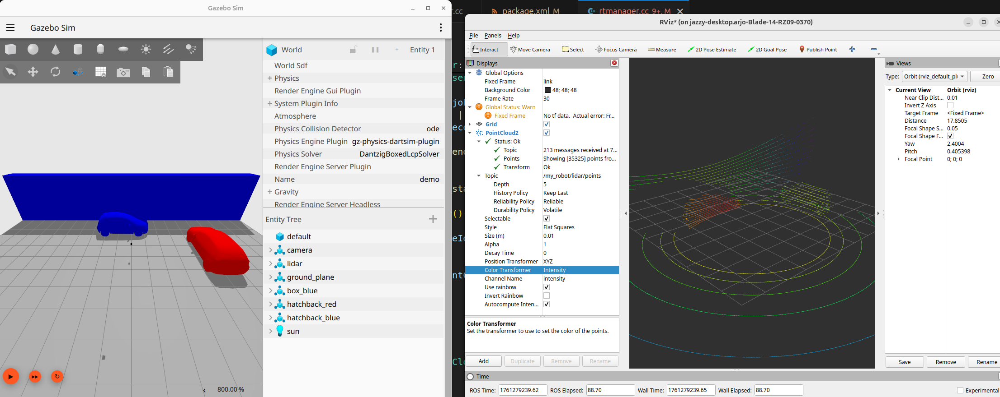
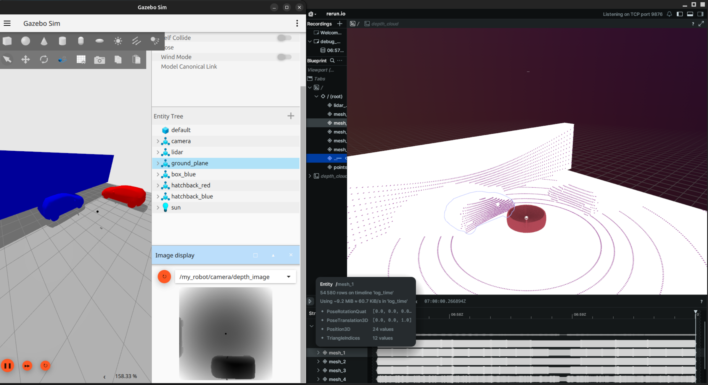

# WGPU based Raytracing Sensors for Gazebo

This project builds on the Raytracing sensors provided by the WGPU sensors library. Currently, this is a proof-of-concept stage and can render boxes, planes, and meshes, with ongoing efforts to expand its capabilities.

## Current Status
This project is in active development. The core framework is functional, supporting both LiDAR and Depth Camera sensors that can run simultaneously. It can accurately render scenes composed of meshes, boxes, and planes.

Summary of current features:
- **Raytracing Sensors**: Provides custom `rt_lidar` and `rt_camera` sensors for Gazebo.
- **Multi-Sensor Support**: Capable of running multiple raytracing sensors simultaneously.
- **Geometry Support**: Currently supports rendering of boxes, planes, and meshes.
- **Data Output**: Publishes standard Gazebo Transport messages.
  - Depth Camera: `gz::msgs::Image` is fully supported and can be visualized with Gazebo's Image Display plugin.
  - LiDAR: `gz::msgs::PointCloudPacked` is published. For the best experience, real-time visualization is provided via the Rerun viewer, which launches automatically.

## Requirements
This package is designed to be built on ROS 2 Jazzy. To build and run this project, you will need:
- A recent version of [Rust](https://www.rust-lang.org/tools/install).
- A non-apple ray-tracing enabled GPU (NVIDIA RTX or above, AMD RX6000 and above, Steam Deck or Intel Battlemage)

## Supported platform
This library is only available as a source build on ROS2 Jazzy.

## Build from source
On ROS2 Jazzy:
```bash
git clone https://github.com/arjo129/gz_wgpu_rt_lidar.git
cd gz_wgpu_rt_lidar
rosdep install --from-paths gz_wgpu_rt_lidar
colcon build
```
Important: Before running Gazebo, ensure your system can find the compiled plugins by sourcing your `install` space:
```bash
source install/setup.bash
```

## Running the Examples
After building and sourcing your workspace, you can run an example SDF file:
```bash
gz sim examples/shapes.sdf
```
This will launch Gazebo Sim with the WGPU raytracing sensors active. You can visualize the sensor output using the built-in Gazebo GUI plugin `Image Display`. Rerun visualization will launch by itself for LiDAR.

### Running with ROS 2 Bridge
To run the demo example with ROS 2 topics bridged from Gazebo, use the provided launch file:
```bash
ros2 launch gz_wgpu_rt_lidar demo_bridge.launch.py
```
This will:
- Launch Gazebo Sim with the demo.sdf world
- Start ros_gz_bridge nodes to bridge the following topics:
  - `/my_robot/camera/depth_image` (sensor_msgs/msg/Image)
  - `/my_robot/lidar/points` (sensor_msgs/msg/PointCloud2)

You can then visualize these topics in RViz2 or any other ROS 2 visualization tool:
```bash
ros2 topic list  # Verify topics are available
rviz2  # Visualize the sensor data
```
If you configure rviz correctly you should get something like:



## Screenshots

Here are some screenshots showcasing the raytraced depth output in the Rerun Viewer:

### Raytraced Box Example

This image shows a simple box rendered with depth information.


### Raytraced Hatchback Model

An example of a more complex mesh (hatchback car) being raytraced with a depth camera.


### Multi-sensor Example
Here is a screenshot showcasing both the LiDAR and Depth Camera sensors running simultaneously in a scene. The left window is Gazebo, and the right is the Rerun viewer, which is used for LiDAR visualization.


## Usage in SDF
To integrate the WGPU-based raytracing sensors into your Gazebo simulation, you need to add the `WGPURtSensor` system plugin to your world and define custom sensors within your models.
1. Add the `WGPURtSensor` world plugin:
```xml
<world name="my_wgpu_world">
  <plugin
    filename="wgpu_rt_sensor"
    name="wgpu_sensor::WGPURtSensor"/>
```
2. Define a Custom Raytracing sensor within your model:

   You can add `rt_camera` or `rt_lidar` sensors to any link within your models. Use `type="custom"` and specify `gz:type` to indicate the WGPU sensor type. An example of a custom camera sensor is shown below:

Depth Camera:
```xml
<!-- Custom Camera Sensor Example -->
<sensor name="my_rt_camera" type="custom" gz:type="rt_camera">
   <always_on>1</always_on>
   <update_rate>10</update_rate>
   <topic>/my_robot/camera/depth_image</topic>
   <gz:rt_camera>
      <image>
         <width>256</width>
         <height>256</height>
      </image>
      <camera>
         <horizontal_fov>59.0</horizontal_fov>
         <near>0.01</near>
         <far>100</far>
      </camera>
   </gz:rt_camera>
</sensor>
```
LidAR Sensor:
```xml
   <!-- Custom LiDAR Sensor -->
   <sensor name="my_rt_lidar" type="custom" gz:type="rt_lidar">
   <always_on>1</always_on>
   <update_rate>10</update_rate>
   <topic>/my_robot/lidar/points</topic>
   <gz:rt_lidar>
      <scan>
         <lasers>5</lasers>
         <steps>256</steps>
         <vertical>
            <min_angle>-0.5</min_angle>
            <max_angle>0.5</max_angle>
         </vertical>
         <horizontal>
            <min_angle>-3.14</min_angle>
            <max_angle>3.14</max_angle>
         </horizontal>
      </scan>
      <range>
         <min>0.1</min>
         <max>100.0</max>
      </range>
   </gz:rt_lidar>
</sensor>
```
Note: These custom sensors should be placed within a model's link in your SDF file.
